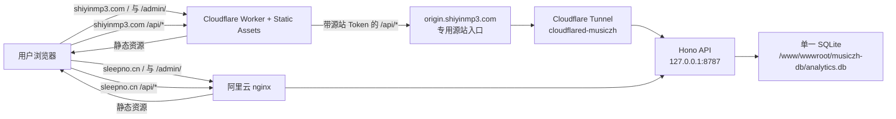

# 拾音 · 生产架构

> 本文是生产拓扑、域名职责、共享状态和跨域边界的**唯一事实源**。
> 当前版本与发布状态看 [CLAUDE.md](../CLAUDE.md)，部署命令和密钥位置看本地
> `DEPLOY.md`，Cloudflare 上线过程与历史证据看
> [实施计划](plans/14-cloudflare-backup-site.md)和
> [复盘 #15](retrospectives/15-cloudflare-api-admin-tunnel-20260828.md)。

## 1. 架构结论

拾音当前是“**双公开入口、单后端、单数据库、两条接入链路**”，不是两套独立系统，
也不是双活后端：

- `shiyinmp3.com` 是 Cloudflare 正式入口，静态资源位于 Workers Static Assets；
- `sleepno.cn` 是阿里云原站，静态资源由 ECS 上的 nginx 提供；
- 两边的 `/api/*` 最终进入阿里云 ECS 上同一个 Hono 进程
  `127.0.0.1:8787`；
- 所有运营数据、管理员账号、功能开关和访问控制规则都落在同一个 SQLite：
  `/www/wwwroot/musiczh-db/analytics.db`；
- 音频解密、转码和打包仍全部发生在浏览器，不经过 Worker、Tunnel、API 或 SQLite。

因此，Cloudflare 解决的是新域名、静态站和另一条 API 接入路径，并没有消除阿里云 API
与 SQLite 的单点。后端或数据库故障时，两个域名的 API 和运营数据都会受影响。

## 2. 请求拓扑

## 3. 域名与路由职责

| Host | 定位 | `/` | `/admin/` | `/api/*` | 备注 |
|---|---|---|---|---|---|
| `shiyinmp3.com` | Cloudflare 正式入口 | Static Assets | Static Assets | Worker → Tunnel → ECS API | 公开、全站 `noindex` |
| `www.shiyinmp3.com` | 别名 | 301 到裸域名 | 保留路径和查询参数后 301 | 同左 | Redirect Rule 在 Cloudflare 控制台，不在仓库 |
| `preview.shiyinmp3.com` | Cloudflare 验收入口 | Static Assets | Static Assets | 同一 Worker 代理 | 非对外主入口、`noindex` |
| `shiyinmp3.musiczh.workers.dev` | 技术恢复入口 | Static Assets | Static Assets | 同一 Worker 代理 | 不作为品牌正式地址 |
| `sleepno.cn` | 阿里云原站 | nginx 静态目录 | nginx 静态目录 | nginx → ECS API | 保留原有 nginx/IP 访问控制 |
| `origin.shiyinmp3.com` | Tunnel 专用源站 | 无用户页面 | 无用户页面 | Token 校验后进入 API | 不是公开产品入口；匿名请求必须 403 |

Cloudflare Worker 仅先执行 `/api` 与 `/api/*`；其他路径交给 Static Assets 和 SPA
fallback。API 代理失败必须返回明确的 502/503/504，不能回退成 `index.html`。

`shiyinmp3.com` 与 `sleepno.cn` 当前是并行产品入口，不做彼此之间的强制跳转；只有
`www.shiyinmp3.com` 是裸域名的纯别名。未来若调整主域、迁移节奏、canonical 或索引策略，
必须作为独立产品/SEO 决策处理，不能在普通部署中顺手修改。

## 4. 哪些状态共享，哪些不共享

### 4.1 真正共享

| 状态 | 共享方式 |
|---|---|
| API 业务逻辑 | 同一个阿里云 Hono/PM2 进程 |
| 运营数据库 | 同一个 SQLite 文件，不存在复制或同步任务 |
| 管理员账号 | 同一 `admins` 表和同一套 seed/密码哈希 |
| 运营统计与失败日志 | 两个域名的事件写进同一批表 |
| 首页运行时配置 | 同一 `feature_flags` 表；格式/QQ 指引开关全局共享，首页公告按两个正式域名使用独立键 |
| IP 规则数据 | 同一 `site_access_ip_rules` 与开关数据 |
| 数据保留与备份 | 同一 365 天清理任务和同一数据库备份链路 |

### 4.2 不共享或只共享一部分

| 状态 | 实际边界 |
|---|---|
| 管理后台登录态 | Cookie 为 host-only、`HttpOnly`、`SameSite=Strict`；两个域名必须分别登录 |
| 访客与会话标识 | `visitor_id`、`session_id`、失败重试队列位于各 Origin 的 Web Storage；跨域不会复用 |
| UV 口径 | 数据库虽共用，同一浏览器跨两个域名访问通常会形成两个 `visitor_id`，当前不能跨域去重 |
| 静态资源 | Cloudflare 与阿里云是两次独立构建/部署；主站还因 QQ 安装包开关产生预期 bundle 差异 |
| DNS、证书和边缘规则 | 分属 Cloudflare 与阿里云/nginx；Cloudflare 控制台规则不随 git 自动恢复 |
| IP 访问控制效果 | 规则数据共享，但当前仅 `sleepno.cn` 的 nginx 对公开页面/API执行；Cloudflare 主站公开 |
| QQ 安装包 | 目前只保留阿里云 `/downloads/` 链路；Cloudflare 构建显示降级 Toast，等待独立方案 |
| 故障与回滚 | 两套静态入口可分别回滚；API/SQLite 故障会同时影响两边的动态能力 |

“共用后台”准确含义是共用账号数据、API 和 SQLite，**不包含共享浏览器登录态、共享访客
身份或完全相同的接入层策略**。

## 5. 数据与统计口径

- 主站 SDK 使用相对地址 `/api/track`，事件由当前域名的同源 API 入口送入同一 SQLite。
- `visitor_id` 存在 `localStorage._sleepno_vid`，`session_id` 和重试队列也按 Origin
  隔离。上线双域名后，后台汇总的总 UV 是“各域名浏览器 ID 的并集”，不是自然人去重。
- v0.8.8 起事件带独立 `site_host` 公共字段，API 以受信接入层 Host 校正两个正式域名；
  首页可展示整体、`sleepno.cn` 和 `shiyinmp3.com` 的 PV/UV。更早历史事件保持空值，
  只计入整体流量，不能稳定反推域名。
- `document.referrer` 仍会随 `pageview` 上报。后台“站内”来源分类同时识别
  `sleepno.cn`、`shiyinmp3.com` 及其子域名；相似后缀域名不会被误判。
- 数据库 schema 或迁移只对唯一 SQLite 执行一次，绝不能按域名各跑一遍。

更完整的事件字段与指标定义见 [ANALYTICS_SPEC.md](ANALYTICS_SPEC.md)。

## 6. 安全与信任边界

### Cloudflare 链路

1. Worker 删除浏览器传入的 `Host`、`Origin`、转发 IP 和内部 Token 等可伪造头；
2. Worker 使用 Secret `ORIGIN_PROXY_TOKEN` 注入源站 Token，并把
   `CF-Connecting-IP` 转为内部受信客户端 IP；
3. Tunnel 只将 `origin.shiyinmp3.com` 转到 `127.0.0.1:8787`，最终 ingress 为 404；
4. API 仅对专用源站 Host 执行恒定时间 Token 校验；无 Token、错误 Token 或生产未配置
   Token 都必须 fail closed；
5. API 响应统一 `no-store`，Cookie 与 `Set-Cookie` 由 Worker 原样转发。

### 阿里云链路

- `sleepno.cn` 经 nginx 直接反代本机 API，不经过 Tunnel Token 门禁；
- 公开站点/IP 限制由 nginx 的 `access_by_lua_block` 调内部判定接口执行；
- `/admin/`、管理 API 和健康检查按现有 nginx 规则豁免公开站点 IP 限制，管理数据仍由
 管理员 Cookie 保护。

前端保持同源相对 `/api` 是默认约束。只有未来明确引入跨域 API 调用时，才同步评估
`ALLOWED_ORIGINS`、预检、Cookie 和 CSRF；不能把“数据库共享”误当成“跨域会话共享”。

## 7. 发布、回滚与故障边界

### 7.1 默认双域名同步发布制度

`shiyinmp3.com` 与 `sleepno.cn` 共同组成一个生产发布单元。除非项目主明确指定单域名
范围，否则“上线”“发布”“更新到生产”一律表示：在同一个发布窗口内把对应变更部署到
两个正式域名，并完成两边验收。这里的“同步”是同一发布任务和同一完成门槛，不要求两个
独立静态平台在同一秒完成部署。

默认产品一致性要求：

- 两个正式域名使用同一源代码提交、相同的主站/后台/API 语义版本；
- 面向用户和管理员的功能、交互、文案、路由和 API 行为保持一致；
- 构建产物可以因已登记的基础设施变量不同而产生字节差异，但不得产生未登记的功能分叉；
- 当前允许的差异只有本文已登记的接入层边界，例如 QQ 安装包降级、独立 Cookie 会话和
  nginx IP 访问控制。新增差异必须先写入本文。

单域名发布属于例外，只有项目主明确说明“只上线哪个域名、另一个域名保持不变”时才成立。
Agent 不得从实现便利、故障状态或模糊表述推断单域名授权。例外必须在计划、PR 或复盘中
记录目标域名、未发布域名、差异原因、影响范围，以及是否和何时恢复同步。

一次双域名发布只有同时满足以下条件才算完成：

1. 对应子项目从同一提交构建，版本号一致；
2. 阿里云和 Cloudflare 两个目标都部署成功；
3. 两个正式域名的对应页面、动态资源和关键功能都通过 smoke；
4. 涉及共享 API 时，API 只部署一次，但必须从两个正式域名分别验证；
5. 所有差异都属于本文已登记差异或本次明确批准的单域名例外。

任何一个目标尚未部署或验收失败，状态只能报告为“发布未完成”或“临时不一致”，不得宣告
上线完成。处理方向必须是完成另一边发布或把已发布一边恢复到原版本，不能静默保留分叉。

### 7.2 发布关系

| 变更 | 必须发布的目标 | 关键顺序 |
|---|---|---|
| 仅主站代码 | 阿里云用户端；Cloudflare Assets | 两边分别构建、分别 smoke |
| 仅后台前端 | 阿里云后台；Cloudflare Assets 中的 `/admin/` | 两边分别验证登录页和动态资源 |
| API/schema/鉴权 | 阿里云 API | 先 API，再检查两个公开入口 |
| Tunnel/源站鉴权 | API → Configure Cloudflare Tunnel → Worker | 禁止先发布指向未受保护源站的 Worker |
| Worker 路由/代理 | Cloudflare Worker | 先保证源站鉴权与 Tunnel 已连通 |
| nginx/IP 访问控制 | 仅阿里云入口 | 不应假设 Cloudflare 自动继承 |

`.github/workflows/validate-cloudflare.yml` 只负责测试、双前端构建和 Wrangler dry-run，
不会自动发布 Cloudflare。阿里云前端由 `deploy.yml` 发布；`server/**` 合并后仍必须手动
dispatch 后端部署。实际命令、Secret 名和恢复步骤以本地 `DEPLOY.md` 为准。

### 7.3 故障影响

| 故障 | Cloudflare 入口 | 阿里云入口 |
|---|---|---|
| Cloudflare 边缘/Worker 故障 | 受影响 | 可继续提供静态页和 API |
| 阿里云 nginx/静态目录故障 | 不影响 Cloudflare 静态资源 | 受影响 |
| Tunnel/cloudflared 故障 | 静态转换可用，Cloudflare API/后台数据不可用 | API 仍可经 nginx 使用 |
| Hono/PM2 故障 | API、配置、埋点、后台数据受影响 | 同样受影响 |
| SQLite 故障 | 两个域名的运营数据能力同时受影响 | 同样受影响 |

只要主站静态资源已经加载，音频本地转换不依赖 API；埋点失败也不能阻断文件完成与下载。

## 8. 所有后续改动的双域名检查清单

涉及主站、后台、API、Cookie、埋点、部署或域名时，合并前逐项确认：

- [ ] 本次发布默认包含两个正式域名；如为单域名例外，已有项目主明确授权和书面差异记录。
- [ ] 两边来自同一提交、版本一致，产品功能和行为一致；构建差异均已登记。
- [ ] 前端仍使用相对 `/api`，没有把任一公开域名硬编码成唯一 API 地址。
- [ ] 新的 Host/Origin/referrer allowlist 同时考虑 `shiyinmp3.com` 与 `sleepno.cn`，并说明
      预览域名是否应纳入。
- [ ] 登录、登出和 CSRF 设计按“两个独立同源会话”验证，不假设跨域共享 Cookie。
- [ ] 埋点变化说明跨域 `visitor_id`/UV 影响；需要分域时先定义可信站点维度。
- [ ] 访问控制变化分别说明 Cloudflare 与 nginx 的执行位置，不能只改共享数据库开关。
- [ ] 静态功能同时构建 Cloudflare 产物和对应阿里云产物；允许差异必须登记为部署变量。
- [ ] API/schema 只部署到唯一后端、迁移唯一数据库，并先做可恢复备份。
- [ ] Smoke 至少覆盖两个正式域名的 `/`、`/admin/`、`/api/health`；Cloudflare 额外覆盖
      API `no-store` 和专用源站匿名 403。
- [ ] 两边部署与验收都成功后才宣告完成；任一失败均明确报告“发布未完成/临时不一致”。
- [ ] `www` 跳转继续保持单次 301，并保留路径与查询参数。
- [ ] 更新本文；若改变操作步骤，再同步本地 `DEPLOY.md`；实施计划和复盘只保存过程证据，
      不代替本文的当前架构。

## 9. 已知债务与外部状态

| 项目 | 当前影响 | 下次处理触发点 |
|---|---|---|
| Cloudflare 没有可读取的 `.deploy-manifest.json` | 公网只能核对资源，不能独立确认发布 commit | 下次改 Cloudflare 发布链路时补 manifest 或等价版本元数据 |
| 历史事件没有 `site_host` | v0.8.8 前流量只能计入整体曲线，不能回溯拆分 | 保持空值，不按域名上线时间或 referrer 猜测回填 |
| `www` Redirect Rule 和 Tunnel ingress 是控制台状态 | 仅从 git 无法完整重建 | 每次域名/路由变更后导出或人工复核并记录证据 |
| QQ 安装包只在阿里云入口可用 | Cloudflare 用户看到降级 Toast | 项目主确定独立方案后单独设计和迁移 |
| v0.8.11 外部网盘链接灰度尚未发布 | 开发版已具备按域名运行时配置；生产 v0.8.10 仍保持上一行状态 | 取得真实 HTTPS 链接并获准发布后，先切 `shiyinmp3.com`；观察后再由项目主确认 `sleepno.cn` |

这些项目不是再建第二套数据库或共享跨域 Cookie 的理由；修复必须继续遵守前述单后端、
同源 API 和浏览器本地处理边界。

## 10. 文档职责

| 文档 | 负责内容 |
|---|---|
| 本文 | 当前生产拓扑、域名职责、共享/隔离状态、安全和故障边界 |
| [CLAUDE.md](../CLAUDE.md) | 当前版本、项目结构、Agent 强制约束和入口摘要 |
| [README.md](../README.md) | 面向开发者的项目总览和最短部署认知 |
| 本地 `DEPLOY.md` | 可执行命令、服务器路径、Secret 位置、发布与回滚手册 |
| [ANALYTICS_SPEC.md](ANALYTICS_SPEC.md) | 事件、字段、指标和多域名统计口径 |
| [实施计划](plans/14-cloudflare-backup-site.md) | 本次 Cloudflare 改造的范围、阶段和验收记录 |
| [复盘 #15](retrospectives/15-cloudflare-api-admin-tunnel-20260828.md) | 上线证据、事故过程和待观察事项 |
